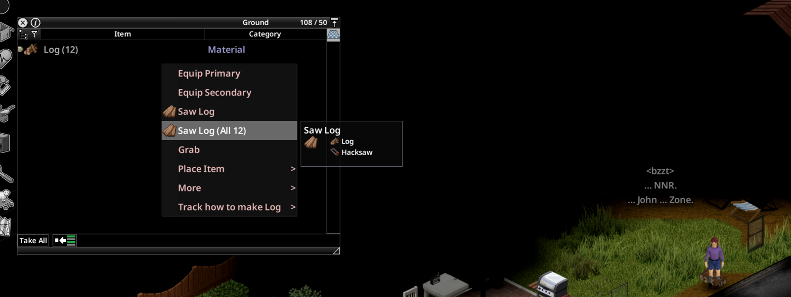
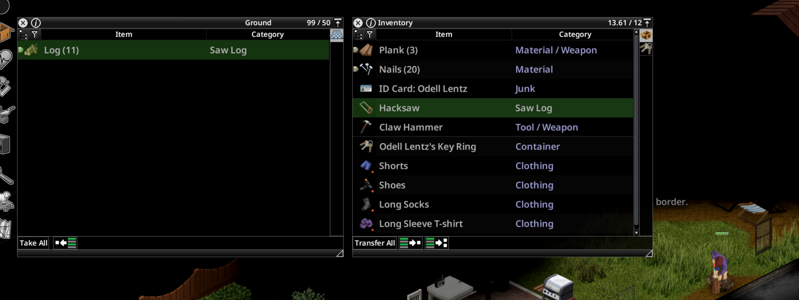

# How to use Craft Whole Stack

## 1. Right-click a stack
Right-click any stack of items in your inventory or in a container. Every recipe in the menu that can be batch-crafted now has a twin with **(All N)** after it.

**N is what you can actually make right now.** It counts your tools, your inputs, and how much you can carry. If you selected part of a stack, N stops at your selection.

## 2. Pick the (All N) option
Your character crafts the whole batch, one action after another, with the normal timings and XP.

To stop partway, move. That cancels the queue like any other action.

## Things worth knowing
- **Stacks in crates:** if a recipe needs the items on you, the mod pulls them from the container first, only as many as you can carry, and queues that many crafts.
- **Tools** go back to the container they came from when the batch finishes.
- **No option showing?** The recipe either isn't batch-craftable (the game marks some recipes one-at-a-time) or you can only make one right now.
- **Multiplayer:** each craft is validated by the server, exactly like the crafting window's quantity box.

## Troubleshooting
If something goes wrong, open an issue with the last 50 lines of `Zomboid/console.txt`:
https://github.com/HxHippy/pz-craft-whole-stack/issues
