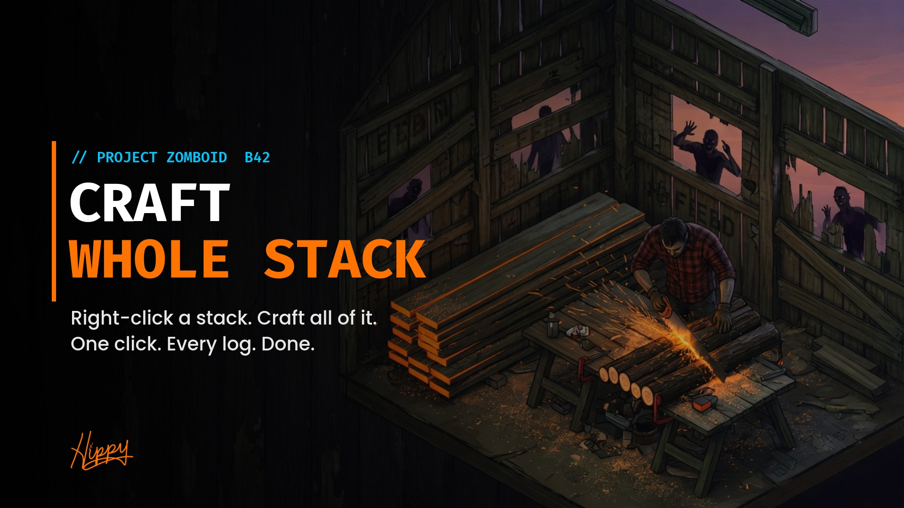

# Craft Whole Stack



**Right-click a stack. Craft all of it.**

**[How to use it](GUIDE.md)** | **[Steam Workshop](https://steamcommunity.com/sharedfiles/filedetails/?id=3808092345)** | **[Issues](https://github.com/HxHippy/pz-craft-whole-stack/issues)**

Craft Whole Stack is a Project Zomboid **Build 42** mod. Right-click a stack and you can run a recipe on the whole thing instead of clicking it once per item.


## What it does
Every recipe in the inventory right-click menu gets a sibling option, for example `Saw Logs (All 12)`.

- **N** is how many times you can actually do it right now. It accounts for tools, inputs, and carry weight.
- Selecting part of a stack caps N at your selection. Right-clicking a single item uses everything available.
- The option only appears on recipes the game marks batch-craftable, which is the same rule as the crafting window's quantity box.
- For recipes that need the items on you, it pulls the stack from the container first, only as much as you can carry.
- You cancel it like any other action queue.

## Multiplayer
Craft Whole Stack is client-side Lua on top of vanilla `ISEntityUI.HandcraftStartMultiple`, the same path the crafting window uses for quantities. The server validates every craft as usual. There's no new network code and no server install beyond having the mod enabled.

## Install
- **[Workshop](https://steamcommunity.com/sharedfiles/filedetails/?id=3808092345):** subscribe, then enable **Craft Whole Stack** in Mods.
- **Manual:** copy this folder to `~/Zomboid/Workshop/CraftWholeStack` and enable it in Mods.
- **Dedicated server:** add `3808092345` to `WorkshopItems=` and `CraftWholeStack` to `Mods=`.

## Layout
```
Contents/mods/CraftWholeStack/
  common/
  42/
    mod.info, poster.png, icon.png
    media/lua/client/CraftWholeStack.lua
    media/lua/shared/Translate/EN/ContextMenu.json
```

## License
MIT

---
Made by **HxHippy**. Built by Kief Studio, powered by LTFI.
